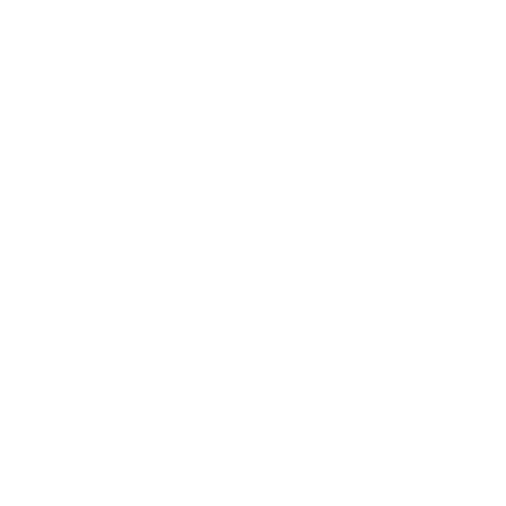

# TexnoLatin Alphabet

This is a reference [TexnoMagic](https://texnoforge.github.io/texnomagic/) alphabet.

Part of [Words of Power](https://texnoforge.dev/words-of-power/) project.

Status: **alpha**

## Symbols

Symbol names are based on latin.

All symbols contain SVG images created in Inkscape (`image/symbol.svg`).

**24** symbols:

* [ignis (fire)](#ignis-fire)
* [gelu (ice)](#gelu-ice)
* [aqua (water)](#aqua-water)
* [aer (air)](#aer-air)
* [fulgur (electro)](#fulgur-electro)
* [terra (earth)](#terra-earth)
* [vita (life)](#vita-life)
* [mors (death)](#mors-death)
* [sagitta (bolt)](#sagitta-bolt)
* [sphaera (ball)](#sphaera-ball)
* [spatium (space)](#spatium-space)
* [conus (cone)](#conus-cone)
* [torrens (beam)](#torrens-beam)
* [ego (self)](#ego-self)
* [amica (friend)](#amica-friend)
* [hostis (enemy)](#hostis-enemy)
* [prope (close)](#prope-close)
* [procul (far)](#procul-far)
* [fortis (strong)](#fortis-strong)
* [infirmus (weak)](#infirmus-weak)
* [magnus (big)](#magnus-big)
* [parvus (small)](#parvus-small)
* [celer (fast)](#celer-fast)
* [tardus (slow)](#tardus-slow)

### ignis (fire)

### gelu (ice)

1 [drawings](symbols/ice/drawings)

### aqua (water)

### aer (air)

### fulgur (electro)

2 [drawings](symbols/electro/drawings)

### terra (earth)

### vita (life)

### mors (death)

### sagitta (bolt)

### sphaera (ball)

### spatium (space)

### conus (cone)

### torrens (beam)

### ego (self)

### amica (friend)

### hostis (enemy)

### prope (close)

### procul (far)

### fortis (strong)

### infirmus (weak)

### magnus (big)

### parvus (small)

### celer (fast)

### tardus (slow)

