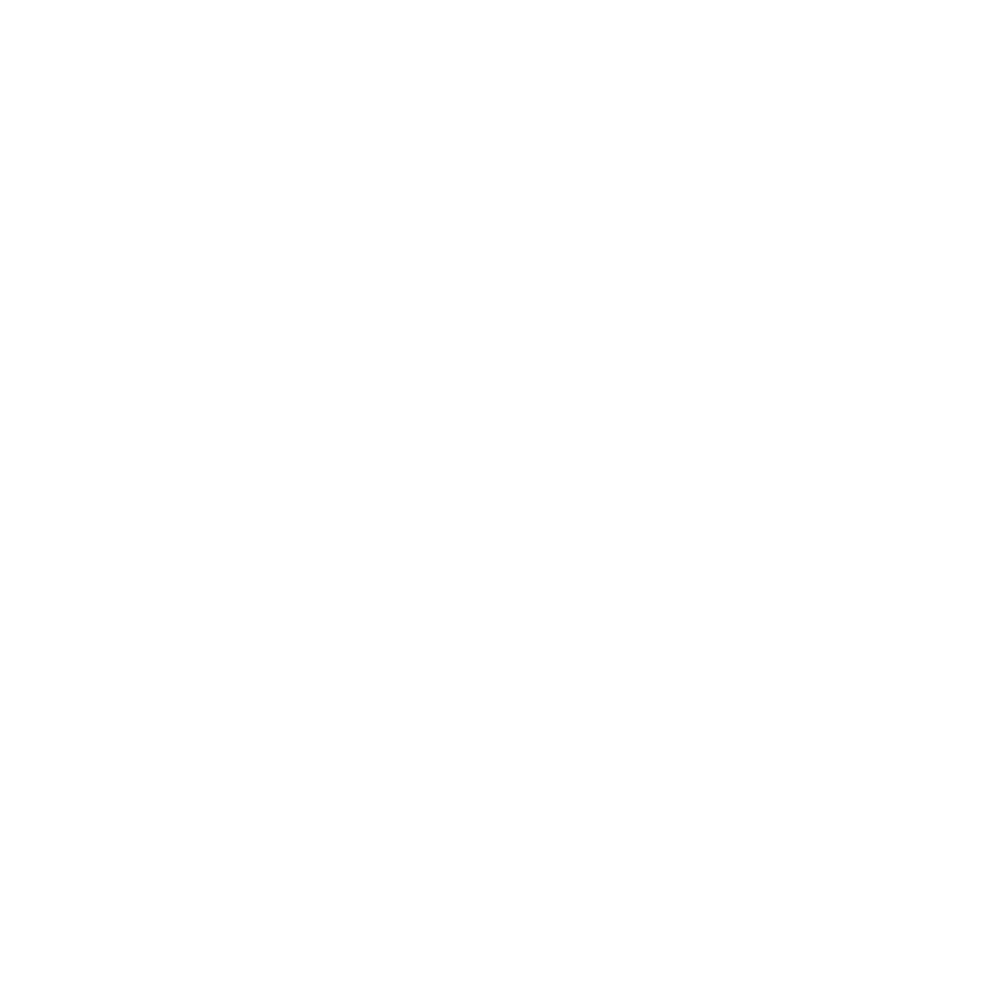
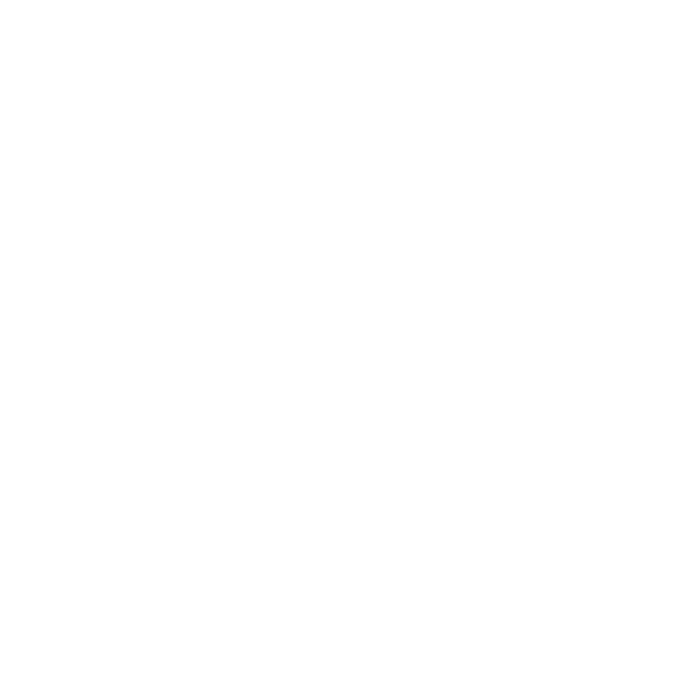

# TexnoLatin Alphabet

This is a reference [TexnoMagic](https://texnoforge.github.io/texnomagic/) alphabet.

It's expected to become a default alphabet for
[Words of Power](https://texnoforge.dev/words-of-power/) project.

View this alphabet online: [wop.texnoforge.dev/abc/texnolatin](https://wop.texnoforge.dev/abc/texnolatin) 👀

Help with gathering training data by **drawing symbols online**: [train.texnoforge.dev](https://train.texnoforge.dev/) 🎨

## Status: alpha

* initial set of **24** symbols
* all symbols have **SVG** image

**Please help** with gathering training data by **drawing symbols** in the comfort of your browser:

[train.texnoforge.dev](https://train.texnoforge.dev/)

Thanks a lot! 🧙

## License

This entire repository is licensed under [CC0](LICENSE) which is fairly close
to public domain.

You're free to use this and you're very welcome to contribute.

## Symbols

Symbol names are based on latin.

All symbols contain SVG images created in Inkscape (`image/symbol.svg`).

**24** symbols:

* [ignis (fire)](#ignis-fire)
* [gelu (ice)](#gelu-ice)
* [aqua (water)](#aqua-water)
* [aer (air)](#aer-air)
* [fulgur (electro)](#fulgur-electro)
* [terra (earth)](#terra-earth)
* [vita (life)](#vita-life)
* [mors (death)](#mors-death)
* [sagitta (bolt)](#sagitta-bolt)
* [sphaera (ball)](#sphaera-ball)
* [spatium (space)](#spatium-space)
* [conus (cone)](#conus-cone)
* [torrens (beam)](#torrens-beam)
* [ego (self)](#ego-self)
* [amica (friend)](#amica-friend)
* [hostis (enemy)](#hostis-enemy)
* [prope (close)](#prope-close)
* [procul (far)](#procul-far)
* [fortis (strong)](#fortis-strong)
* [infirmus (weak)](#infirmus-weak)
* [magnus (big)](#magnus-big)
* [parvus (small)](#parvus-small)
* [celer (fast)](#celer-fast)
* [tardus (slow)](#tardus-slow)

### ignis (fire)

17 [drawings](symbols/fire/drawings)

### gelu (ice)

18 [drawings](symbols/ice/drawings)

### aqua (water)

11 [drawings](symbols/water/drawings)

### aer (air)

22 [drawings](symbols/air/drawings)

### fulgur (electro)

16 [drawings](symbols/electro/drawings)

### terra (earth)

11 [drawings](symbols/earth/drawings)

### vita (life)

11 [drawings](symbols/life/drawings)

### mors (death)

12 [drawings](symbols/death/drawings)

### sagitta (bolt)

18 [drawings](symbols/bolt/drawings)

### sphaera (ball)

15 [drawings](symbols/ball/drawings)

### spatium (space)

14 [drawings](symbols/space/drawings)

### conus (cone)

10 [drawings](symbols/cone/drawings)

### torrens (beam)

12 [drawings](symbols/beam/drawings)

### ego (self)

16 [drawings](symbols/self/drawings)

### amica (friend)

20 [drawings](symbols/friend/drawings)

### hostis (enemy)

14 [drawings](symbols/enemy/drawings)

### prope (close)

13 [drawings](symbols/close/drawings)

### procul (far)

22 [drawings](symbols/far/drawings)

### fortis (strong)

13 [drawings](symbols/strong/drawings)

### infirmus (weak)

11 [drawings](symbols/weak/drawings)

### magnus (big)

17 [drawings](symbols/big/drawings)

### parvus (small)

17 [drawings](symbols/small/drawings)

### celer (fast)

13 [drawings](symbols/fast/drawings)

### tardus (slow)

13 [drawings](symbols/slow/drawings)
